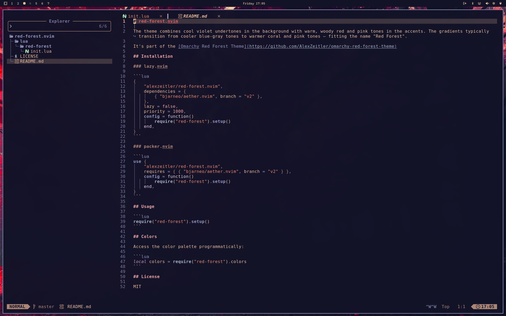

# red-forest.nvim

The theme combines cool violet undertones in the background with warm, woody red and pink tones in the accents. The gradients typically transition from cooler blue-gray tones to warmer coral and pink tones – fitting the name "Red Forest".

It's part of the [Omarchy Red Forest Theme](https://github.com/AlexZeitler/omarchy-red-forest-theme)


## Installation

### lazy.nvim

```lua
{
    "alexzeitler/red-forest.nvim",
    dependencies = {
        { "bjarneo/aether.nvim", branch = "v2" },
    },
    lazy = false,
    priority = 1000,
    config = function()
        require("red-forest").setup()
    end,
}
```

### packer.nvim

```lua
use {
    "alexzeitler/red-forest.nvim",
    requires = { { "bjarneo/aether.nvim", branch = "v2" } },
    config = function()
        require("red-forest").setup()
    end,
}
```

## Usage

```lua
require("red-forest").setup()
```

## Colors

Access the color palette programmatically:

```lua
local colors = require("red-forest").colors
```

## License

MIT
